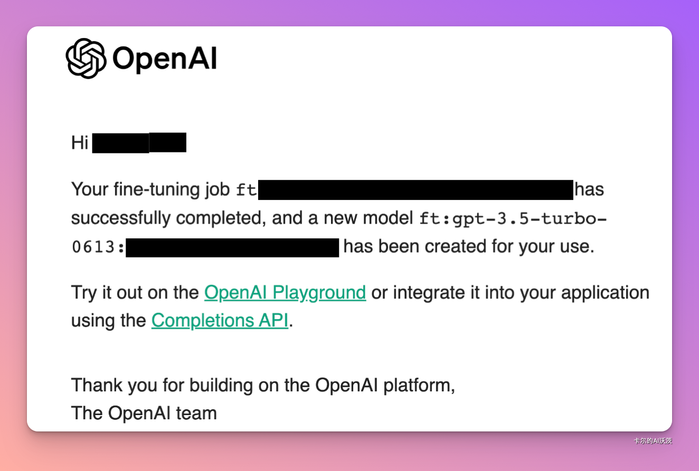

# openai 3.5微调实战

🎉 **OpenAI GPT-3.5 Turbo 微调功能发布！**

OpenAI 刚刚为 GPT-3.5 Turbo 推出了一项革命性的微调功能！GPT-4 的微调将于今年秋天推出。以下是这项技术的关键信息和特色：

### 微调功能简介

1. **个性化训练**：微调允许开发者根据自己的数据训练模型，并在大规模下运行。
2. **卓越性能**：早期测试显示，微调后的 GPT-3.5 Turbo 可以在特定任务上与 GPT-4 相匹敌甚至超越。
3. **隐私保障**: 从微调API发送的数据归客户所有，OpenAI或任何其他组织都不会使用它来训练其他模型。

### 微调的优势

1. **定制体验**：每个业务和应用都有特定需求，微调确保开发者能调整 GPT 输出，提供真正差异化的体验。例如，开发人员可以使用微调来确保模型在提示使用该语言时始终以德语响应。
2. **成本效益**：有可能减少高达 90% 的提示大小，企业可以更快速、更经济地进行 API 调用。
3. **扩展能力**：新模型最多可以处理 4K 代币，对处理大数据集的开发者有利。
4. **可靠的输出格式**：微调可提高模型一致格式化响应的能力，这对于需要特定响应格式的应用程序（例如代码完成或撰写 API 调用）来说至关重要。开发人员可以使用微调来更可靠地将用户提示转换为可与自己的系统一起使用的高质量 JSON 代码段。

### 微调成本

- **训练**：每 1K token $0.008
- **使用输入**：每 1K token $0.012
- **使用输出**：每 1K token $0.016

例如，100,000 代币的 gpt-3.5-turbo 微调工作，训练 3 个周期的预期成本为 $2.40。

### ****微调步骤****

- Step1 准备数据

```jsx
{
  "messages": [
    { "role": "system", "content": "You are an assistant that occasionally misspells words" },
    { "role": "user", "content": "Tell me a story." },
    { "role": "assistant", "content": "One day a student went to schoool." }
  ]
}
```

- Step2 上传文件

```jsx
curl -https://api.openai.com/v1/files \
  -H "Authorization: Bearer $OPENAI_API_KEY" \
  -F "purpose=fine-tune" \
  -F "file=@path_to_your_file"
```

- Step 3 开始微调

```jsx
curl https://api.openai.com/v1/fine_tuning/jobs \
-H "Content-Type: application/json" \
-H "Authorization: Bearer $OPENAI_API_KEY" \
-d '{
  "training_file": "TRAINING_FILE_ID",
  "model": "gpt-3.5-turbo-0613",
}'
```

- step4 直接使用

```jsx
curl https://api.openai.com/v1/chat/completions \
-H "Content-Type: application/json" \
-H "Authorization: Bearer $OPENAI_API_KEY" \
-d '{
  "model": "ft:gpt-3.5-turbo:org_id",
  "messages": [
    {
      "role": "system",
      "content": "You are an assistant that occasionally misspells words"
    },
    {
      "role": "user",
      "content": "Hello! What is fine-tuning?"
    }
  ]
}'
```

### 微调中文医疗版GPT 3.5

#### system 消息是否必需？

前面“偶尔拼错单词”的 system 消息只服务于拼写风格示例，不应复制进无关的问答数据。system 消息可按实际任务设置，也可以省略；本节转换器和推理示例默认省略它。使用 `--system-prompt` 时，推理时也应传入相同的任务指令。

减少指令可节省 token，但应通过验证集比较效果；尤其样本较少时，保留有效任务指令通常更稳妥。参见 [OpenAI 微调最佳实践](https://developers.openai.com/api/docs/guides/fine-tuning-best-practices)。

转换命令：`python 1_process.py test_datasets.jsonl output.jsonl`；可选加上 `--system-prompt "你的任务指令"`。以下为历史教学示例，模型、价格与接口请以当前官方文档为准。

- 数据来源

Huatuo-26M 数据集是由多个来源收集和整合而成，主要包括：

- 在线医疗百科
- 医疗知识图谱
- 网络上的公开医疗问答论坛（答案为url形式）

数据集中的每个问答对包含以下字段：

- Question：问题描述
- Answer：医生/专家的答案

以下为我们在论文中使用的huatuo测试集，由多个来源中数据随机抽取组成。

- Testdatasets：[huatuo26M-testdatasets](https://huggingface.co/datasets/FreedomIntelligence/huatuo26M-testdatasets)

官方推荐的是数量仅仅需求**50-100**个数量！这里我随机抽取了Testdatasets里面100个数据

```python
import json
import random

def transform_jsonl(input_file_path, output_file_path, system_prompt=None):
    entries = []
    with open(input_file_path, 'r', encoding='utf-8') as file:
        for line in file:
            entry = json.loads(line)
            entries.append(entry)

    # 随机抽取100个条目
    sampled_entries = random.sample(entries, 100)

    with open(output_file_path, 'w', encoding='utf-8') as outfile:
        for entry in sampled_entries:
            messages = []
            if system_prompt:
                messages.append({"role": "system", "content": system_prompt})
            user_message = {"role": "user", "content": entry["questions"]}
            assistant_message = {"role": "assistant", "content": entry["answers"]}
            messages.extend([user_message, assistant_message])
            result = {"messages": messages}
            json.dump(result, outfile, ensure_ascii=False)
            outfile.write('\n')

if __name__ == '__main__':
    import argparse

    parser = argparse.ArgumentParser(description='随机抽取 100 条问答，转换为微调 JSONL。')
    parser.add_argument('input_file', help='至少包含 100 条问答的 JSONL 文件')
    parser.add_argument('output_file', nargs='?', default='output.jsonl')
    parser.add_argument('--system-prompt', help='可选任务指令；推理时应保持一致')
    args = parser.parse_args()
    transform_jsonl(args.input_file, args.output_file, args.system_prompt)
```

- 上传文件「这里我也转成了python文件，方便大家使用」

```jsx
import requests
import openai

url = "https://api.openai.com/v1/files"
headers = {
    "Authorization": "Bearer $OPENAI_API_KEY"
}
payload = {
    "purpose": "fine-tune",
}
files = {
    "file": open("上一步输出文件的路径", "rb")
}

response = requests.post(url, headers=headers, data=payload, files=files)
print(response)
print(openai.File.list())
```

输出**<Response [200]>代表文件上传成功，同时也会输出文件的ID**

```jsx
{
      "object": "file",
      "id": "file-XXXXXXXXXXX",
      "purpose": "fine-tune",
      "filename": "output.jsonl",
      "bytes": 70137,
      "created_at": 1692763379,
      "status": "processed",
      "status_details": null
 }
```

- 进行微调

```jsx
import requests

url = "https://api.openai.com/v1/fine_tuning/jobs"
headers = {
    "Content-Type": "application/json",
    "Authorization": "Bearer $OPENAI_API_KEY"
}
data = {
    "training_file": "file-XXXXXXXXXXX",
    "model": "gpt-3.5-turbo-0613"
}

response = requests.post(url, headers=headers, json=data)
print(response.text)
```

微调完成之后会自动发送到你账户的邮箱📮



- 模型使用

```jsx
import requests

url = "https://api.openai.com/v1/chat/completions"
headers = {
    "Content-Type": "application/json",
    "Authorization": "Bearer $OPENAI_API_KEY"
}
data = {
    "model": "ft:gpt-3.5-turbo-0613:xxxxxxxx",
    "messages": [
        {
            "role": "user",
            "content": "我在体检是正常的，但是去献血医生最是说我的血压高，不能献。血压是130、80这是为什么呢？"
        }
    ]
}

response = requests.post(url, headers=headers, json=data)
print(response.text)
```

- 效果对比

| 用户输入 | gpt-3.5-turbo-0613 | 仅用100条数据微调后 |
| --- | --- | --- |
| 我在体检是正常的，但是去献血医生最是说我的血压高，不能献。血压是130、80这是为什么呢？ | 血压130/80是正常血压，但是献血的标准要求血压低于120/80，所以您的血压超出了献血的标准，不能献血。 | 首次值得注意的是，在献血的时候，会出现生理性的兴奋，反射性的引起血压升高。一般情况下小于140、90mmHg，是允许献血的。对于一些持续性的血压升高的就需要积极的调理了。 |

微调过后我们不需要写prompt也能够让gpt-3.5-turbo-0613有更加专业的回复！

### 关键问题与考虑

- **成本问题**：微调虽便宜，模型可能产生 6-8 倍的 GPT3.5 常规费用。
- **投资与回报**：人们是否愿意投入更多资金微调模型，而不仅是进行更好的提示或链接？

### 即将到来

- **新微调仪表板**
- **更多用户友好工具**

微调功能无疑将为 AI 领域带来新的可能性和挑战。企业和开发者可以期待更多定制化和高效的解决方案。🚀